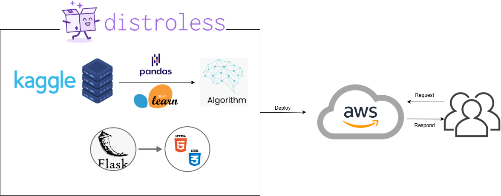
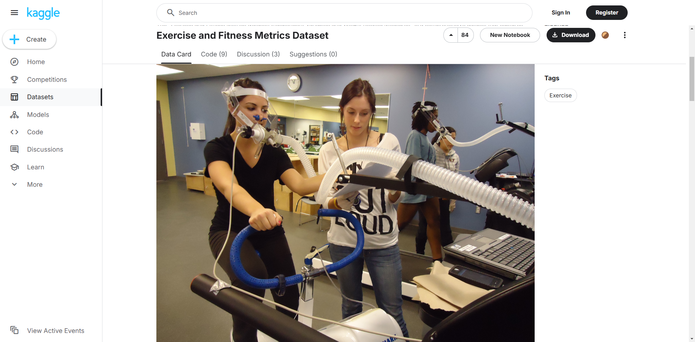

[](https://github.com/haobo-yuan/IDS706-FinalProject/actions/workflows/locust.yml)

# [Jogging Weight Loss Guide](https://nzcfuqgcka.us-east-2.awsapprunner.com)

* Contributors: Haobo Yuan, Jiaxin Gao, Xiangyu Wang, Su Zhang
* Deployed Application: https://nzcfuqgcka.us-east-2.awsapprunner.com

## Introduction

This project implements a microservice using Flask to help users calculate their expected calories burned per jogging session, the duration of jogging sessions, and the estimated MET (Metabolic Equivalent of Task) level based on user input. The microservice interfaces with a data pipeline and provides detailed, personalized fitness insights.

## Project Roadmap



## Quick View

Home Page: https://nzcfuqgcka.us-east-2.awsapprunner.com/ 


Input Page:


Output Page:


## Features

- **Calculate Calories Burned per Session:** Estimate the calories burned based on the user's current weight, desired weight, time frame, and exercise frequency.
- **Calculate Duration of Jogging Sessions:** Suggest the optimal duration per session to achieve the target weight.
- **Estimate MET Level:** Provide the expected MET level based on user characteristics and exercise intensity.

## User Inputs

The application requires the following inputs from the user:

- **`actual_weight`**: Current weight in kilograms.
- **`dream_weight`**: Desired weight in kilograms.
- **`num_of_weeks`**: Number of weeks to achieve the target weight.
- **`week_frequency`**: Number of jogging sessions per week.
- **`height`**: Height in meters.
- **`age`**: Age in years.
- **`exercise_intensity`**: Jogging intensity (scale of 1–10).
- **`gender`**: User's gender (`'Male'` or `'Female'`).

## Project Structure

```
.
.
├── .devcontainer/               # Configuration for Visual Studio Code DevContainer
│   ├── devcontainer.json        # DevContainer settings
│   └── Dockerfile               # Dockerfile for DevContainer setup
├── .github/workflows/           # GitHub Actions workflows for CI/CD
│   ├── format.yml               # Workflow for code formatting checks
│   ├── install.yml              # Workflow for installation checks
│   ├── lint.yml                 # Workflow for linting checks
│   └── test.yml                 # Workflow for running tests
├── .pytest_cache/               # Pytest cache directory
├── logging/                     # Logging-related configuration files (if any)
├── readme_components/           # Components or templates for README (if applicable)
├── src/                         # Source code for the application
│   ├── __pycache__/             # Cached Python bytecode files
│   ├── static/                  # Static files (CSS, JS, images)
│   ├── templates/               # HTML templates for Flask
│   ├── app.py                   # Flask application entry point
│   ├── locust_test.py           # Locust performance testing script
│   └── main.py                  # Main application logic for calculations
├── .flake8                      # Flake8 configuration file
├── .gitignore                   # Git ignore file
├── Dockerfile                   # Dockerfile for containerizing the application
├── exercise_dataset.csv         # Dataset used for MET estimation and calculations
├── LICENSE                      # License file
├── Makefile                     # Makefile for automating tasks (linting, testing, etc.)
├── README.md                    # Project documentation
├── requirements.txt             # Python dependencies
└── test_main.py                 # Unit tests for the main application logic

```

## Dataset

We use the dataset from [Kaggle](https://www.kaggle.com/uciml/exercise-calories-dataset) to do the analysis and modeling.



## Functions in `main.py`

### 1. **`total_calories_to_burn(actual_weight, dream_weight)`**
   - **Description**: Calculates the total number of calories required to reach the desired weight.
   - **Inputs**:
     - `actual_weight`: Current weight in kilograms.
     - `dream_weight`: Target weight in kilograms.
   - **Returns**: Total calories to burn or a message if no weight loss is needed.

### 2. **`calculate_target_calories_and_duration(params)`**
   - **Description**: Calculates the calories to burn per session, jogging session duration, and estimated MET value.
   - **Inputs**: A dictionary `params` containing:
     - `actual_weight`
     - `dream_weight`
     - `num_of_weeks`
     - `week_frequency`
     - `height`
     - `age`
     - `exercise_intensity`
     - `gender`
   - **Returns**: A tuple with:
     - Calories per session
     - Duration of each jogging session
     - Estimated MET level
   - **Raises**: `ValueError` if any input is invalid or estimated MET is non-positive.

---

## Running the Application locally

```bash
git clone https://github.com/haobo-yuan/IDS706-FinalProject.git
cd IDS706-FinalProject
pip install -r requirements.txt
python src/app.py
```

## Testing

Run the unit tests with:
```bash
pytest
```

---

## Development Workflow

1. **Lint**: Ensure code quality with:
   ```bash
   make lint
   ```

2. **Format**: Format code using `black`:
   ```bash
   make format
   ```

3. **Test**: Run tests to ensure functionality:
   ```bash
   make test
   ```

4. **Locust_Test**: Run Locust performance test:
   ```bash
   make locust_test
   ```

5. **Full Build**: Install dependencies, format, lint, and test:
   ```bash
   make all
   ```
   
## Containerization with Distroless

```bash
docker build -t your-app:latest .

docker run -p 8080:8080 your-app:latest
```
Access the application at:
> http://localhost:8080

docker build successfully:


## Load Test - Locust Performance Test
Aiming to the service provided by app.py, locust the core function to execute the performance test. 


Locust is used to assess the performance of a web application hosted on http://localhost:8080. The test was structured to simulate interactions with three endpoints: /, /input, and /result. The results revealed critical insights into the application's handling of traffic:

- Request Statistics: The /input and /result endpoints accounted for the bulk of the traffic, each handling over 55,000 requests, while the homepage (/) received around 18,500 requests. Despite the high volume, response times were impressively low, with averages of 9.72 ms for /, 15.88 ms for /input, and 6.05 ms for /result. The peak RPS for /input and /result exceeded 110, demonstrating the application's capacity to process substantial traffic efficiently.

- Response Time Distribution: A deeper look at response times showed that the majority of requests were processed within single-digit milliseconds. 

- Task Distribution: The test emphasized tasks related to input submission and result retrieval, which made up 75% of the simulated user activities. The remaining 25% focused on homepage interactions.
  
The Report could be checked [HERE](readme_components/Locust.pdf). 


## Deployment of Service
The integration of Flask, Docker, and AWS creates a streamlined environment for building, containerizing, and deploying web applications. Here’s a concise breakdown of each component:

- Flask: Flask is a lightweight Python web framework that allows developers to quickly build web applications and APIs. Its minimalistic design and modularity make it a popular choice for scalable projects.

- Docker:Docker enables the packaging of applications and their dependencies into lightweight, portable containers. This ensures consistency across development, testing, and production environments.

- AWS:AWS offers robust cloud infrastructure for hosting applications. Services like Elastic Container Registry (ECR) and App Runner allow seamless deployment and management of containerized applications, providing scalability, reliability, and monitoring capabilities.

When combined, Flask serves as the application layer, Docker ensures portability, and AWS provides the deployment platform, resulting in a flexible and powerful deployment pipeline.The service could be visited by: https://nzcfuqgcka.us-east-2.awsapprunner.com/

## Project Limitations and Potential Areas of Improvement

### Limitations
The current version of the **Jogging Session Calculator Microservice** provides basic functionality for estimating calories burned, jogging duration, and MET levels, but it has several limitations that could impact its utility and user satisfaction:

- **Limited Scope of Exercise Types**: The application is tailored specifically for jogging and does not accommodate other forms of exercise or physical activity, which may reduce its relevance for users with varied fitness routines.
- **Lack of Real-Time Adaptation**: The tool does not dynamically adjust recommendations based on progress updates, such as changes in weight, fitness level, or jogging frequency.
- **No Integration with Wearables or Health Apps**: The microservice lacks integration with fitness wearables or apps, which limits its ability to automatically track user activity or provide real-time feedback.
- **Static Input Parameters**: The application assumes fixed parameters (e.g., weight, height, gender) without accounting for physiological variations such as muscle mass or metabolic rate that could influence calorie calculations.

### Potential Improvements
To address these limitations and enhance user experience, the following improvements could be made to the microservice:

- **Incorporate Additional Activities**: Expand the microservice to support a variety of physical activities, including cycling, swimming, or strength training, to cater to diverse fitness preferences.
- **Enable Progress Tracking**: Introduce functionality to allow users to log ongoing progress and receive updated recommendations based on their performance and evolving fitness levels.
- **Integrate with Health Ecosystems**: Develop APIs for integration with wearable devices (e.g., Fitbit, Apple Watch) or health apps, enabling automatic tracking of activity metrics such as heart rate and step count.
- **Enhance Personalization**: Utilize machine learning models to personalize MET and calorie estimations based on detailed physiological profiles, including basal metabolic rate, body composition, and past exercise data.

### AI Application Tools in Development
During the development of the **Jogging Weight Loss Guide** project, we used **GitHub Copilot**, **Tabnine**, and **ChatGPT** to boost productivity and improve code quality:

- **GitHub Copilot**:  
  - **Code Completion**: Helped write Flask routes and function skeletons.  
  - **Debugging**: Suggested fixes for errors and logic issues.

- **Tabnine**:  
  - **Smart Suggestions**: Provided context-aware code predictions.  
  - **Optimization**: Improved data processing and looping efficiency.  
  - **Documentation**: Generated helpful comments and docstrings.

- **ChatGPT**:  
  - **Algorithm Help**: Assisted with MET and calorie calculation logic.  
  - **Debugging**: Provided step-by-step solutions for complex errors.  
  - **Refactoring**: Suggested cleaner, more efficient code structures.


### Collaborative Task Allocation
- **Haobo:** Developed the Flask microservice, containerized with Distroless Docker, and implemented logging.
- **Jiaxin (Cindy):** Handled data processing, implemented the machine learning model, and demo video editing.
- **Su (Sue):** Assisted backend development, organized README, and handled CI/CD implementation.
- **Xiangyu (Samantha):** Managed AWS deployment with Terraform and conducted Locust performance testing.

