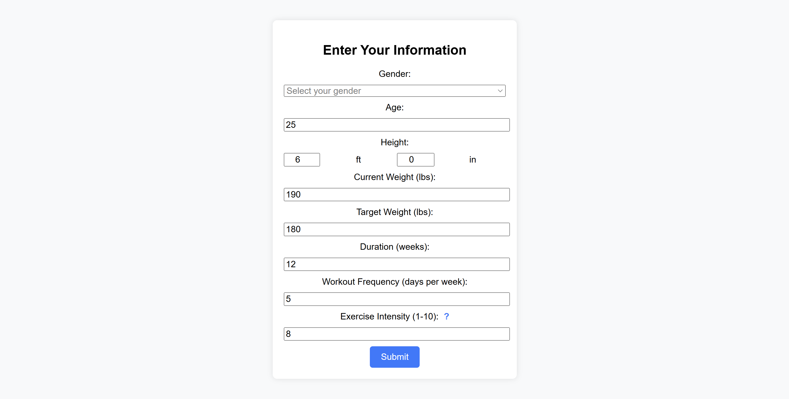
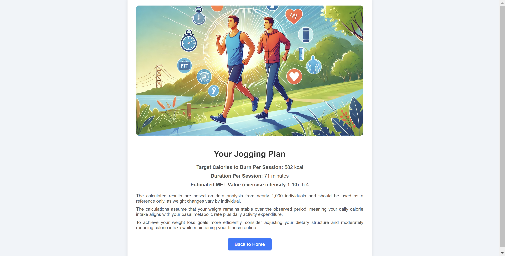
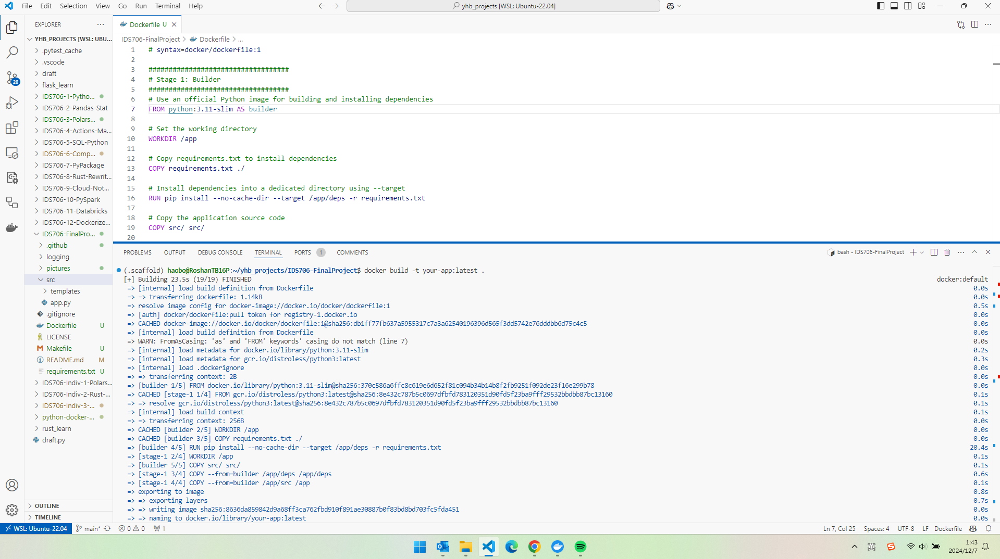

[](https://github.com/haobo-yuan/IDS706-FinalProject/actions/workflows/locust.yml)

# IDS706 Final Project

* Contributors: Haobo Yuan, Jiaxin Gao, Xiangyu Wang, Su Zhang

## Jogging Session Calculator Microservice

This project implements a microservice using Flask to help users calculate their expected calories burned per jogging session, the duration of jogging sessions, and the estimated MET (Metabolic Equivalent of Task) level based on user input. The microservice interfaces with a data pipeline and provides detailed, personalized fitness insights.

## Quick View
Home Page:


Input Page:


Output Page:



## Features

- **Calculate Calories Burned per Session:** Estimate the calories burned based on the user's current weight, desired weight, time frame, and exercise frequency.
- **Calculate Duration of Jogging Sessions:** Suggest the optimal duration per session to achieve the target weight.
- **Estimate MET Level:** Provide the expected MET level based on user characteristics and exercise intensity.

## User Inputs

The application requires the following inputs from the user:

- **`actual_weight`**: Current weight in kilograms.
- **`dream_weight`**: Desired weight in kilograms.
- **`num_of_weeks`**: Number of weeks to achieve the target weight.
- **`week_frequency`**: Number of jogging sessions per week.
- **`height`**: Height in meters.
- **`age`**: Age in years.
- **`exercise_intensity`**: Jogging intensity (scale of 1–10).
- **`gender`**: User's gender (`'Male'` or `'Female'`).

---

## Project Structure

```
.
.
├── .devcontainer/               # Configuration for Visual Studio Code DevContainer
│   ├── devcontainer.json        # DevContainer settings
│   └── Dockerfile               # Dockerfile for DevContainer setup
├── .github/workflows/           # GitHub Actions workflows for CI/CD
│   ├── format.yml               # Workflow for code formatting checks
│   ├── install.yml              # Workflow for installation checks
│   ├── lint.yml                 # Workflow for linting checks
│   └── test.yml                 # Workflow for running tests
├── .pytest_cache/               # Pytest cache directory
├── logging/                     # Logging-related configuration files (if any)
├── readme_components/           # Components or templates for README (if applicable)
├── src/                         # Source code for the application
│   ├── __pycache__/             # Cached Python bytecode files
│   ├── static/                  # Static files (CSS, JS, images)
│   ├── templates/               # HTML templates for Flask
│   ├── app.py                   # Flask application entry point
│   ├── locust_test.py           # Locust performance testing script
│   └── main.py                  # Main application logic for calculations
├── .flake8                      # Flake8 configuration file
├── .gitignore                   # Git ignore file
├── Dockerfile                   # Dockerfile for containerizing the application
├── exercise_dataset.csv         # Dataset used for MET estimation and calculations
├── LICENSE                      # License file
├── Makefile                     # Makefile for automating tasks (linting, testing, etc.)
├── README.md                    # Project documentation
├── requirements.txt             # Python dependencies
└── test_main.py                 # Unit tests for the main application logic

```

## Running the Application locally

```bash
git clone https://github.com/haobo-yuan/IDS706-FinalProject.git
cd IDS706-FinalProject
pip install -r requirements.txt
python src/app.py
```
---

## Functions in `main.py`

### 1. **`total_calories_to_burn(actual_weight, dream_weight)`**
   - **Description**: Calculates the total number of calories required to reach the desired weight.
   - **Inputs**:
     - `actual_weight`: Current weight in kilograms.
     - `dream_weight`: Target weight in kilograms.
   - **Returns**: Total calories to burn or a message if no weight loss is needed.

### 2. **`calculate_target_calories_and_duration(params)`**
   - **Description**: Calculates the calories to burn per session, jogging session duration, and estimated MET value.
   - **Inputs**: A dictionary `params` containing:
     - `actual_weight`
     - `dream_weight`
     - `num_of_weeks`
     - `week_frequency`
     - `height`
     - `age`
     - `exercise_intensity`
     - `gender`
   - **Returns**: A tuple with:
     - Calories per session
     - Duration of each jogging session
     - Estimated MET level
   - **Raises**: `ValueError` if any input is invalid or estimated MET is non-positive.

---


## Testing

Run the unit tests with:
```bash
pytest
```

---

## Development Workflow

1. **Linting**: Ensure code quality with:
   ```bash
   make lint
   ```

2. **Formatting**: Format code using `black`:
   ```bash
   make format
   ```

3. **Testing**: Run tests to ensure functionality:
   ```bash
   make test
   ```

4. **Full Build**: Install dependencies, format, lint, and test:
   ```bash
   make all
   ```


## Containerization with Distroless

```bash
docker build -t your-app:latest .

docker run -p 8080:8080 your-app:latest
```
Access the application at:
> http://localhost:8080

docker build successfully:


## Locust Test
Aiming to the service provided by app.py, locust the core function to execute the performance test. 


The Report could be checked . 


